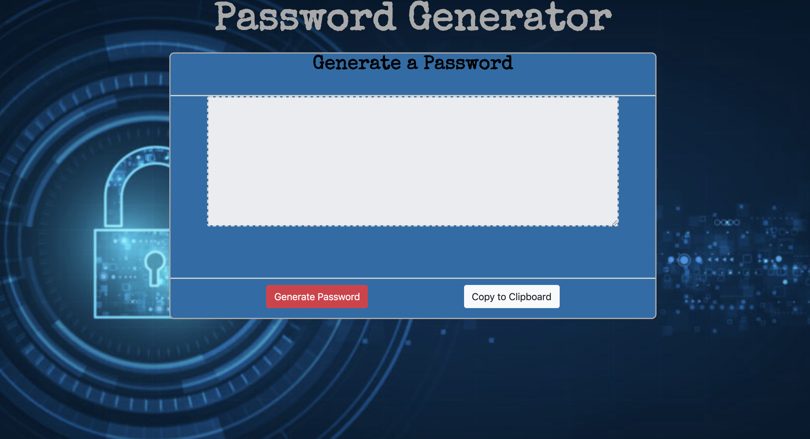

# Password Genertor

## About/Description
This application is a password generator, which is a software tool that creates random or customized passwords base on users' preferences. It helps users to create stronger passwords that provide greater security for a given type of access. 

This password generator prompts the user to choose numbers, uppercase letters, lowercase letters, and special characters when creating their password. Users must also choose the length of  8-128 characters. If they do not, an alert will appear and the user will not be able to move forward with creating their random password. After selecting all of their preferred character types, the password generator will produce a random complex/strong password for the user.

## Technologies/Languages 
* HTML
* Bootstrap 4
* CSS
* JavaScript

## Launch 
 
Password Generator [live demo link](https://zfrakes.github.io/Password-Generator/)

## Illustration/Image 

## Author 
This application was created by Zoey Frakes. To contact please email at zfrakes811@gmail.com

## License 
Copyright © 2019 Zoey Frakes. All Rights Reserved.